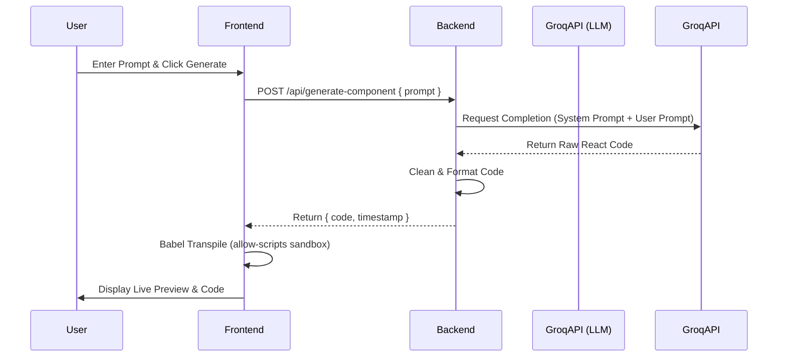
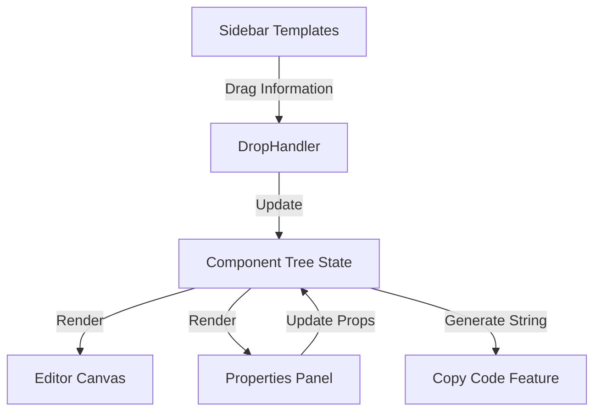
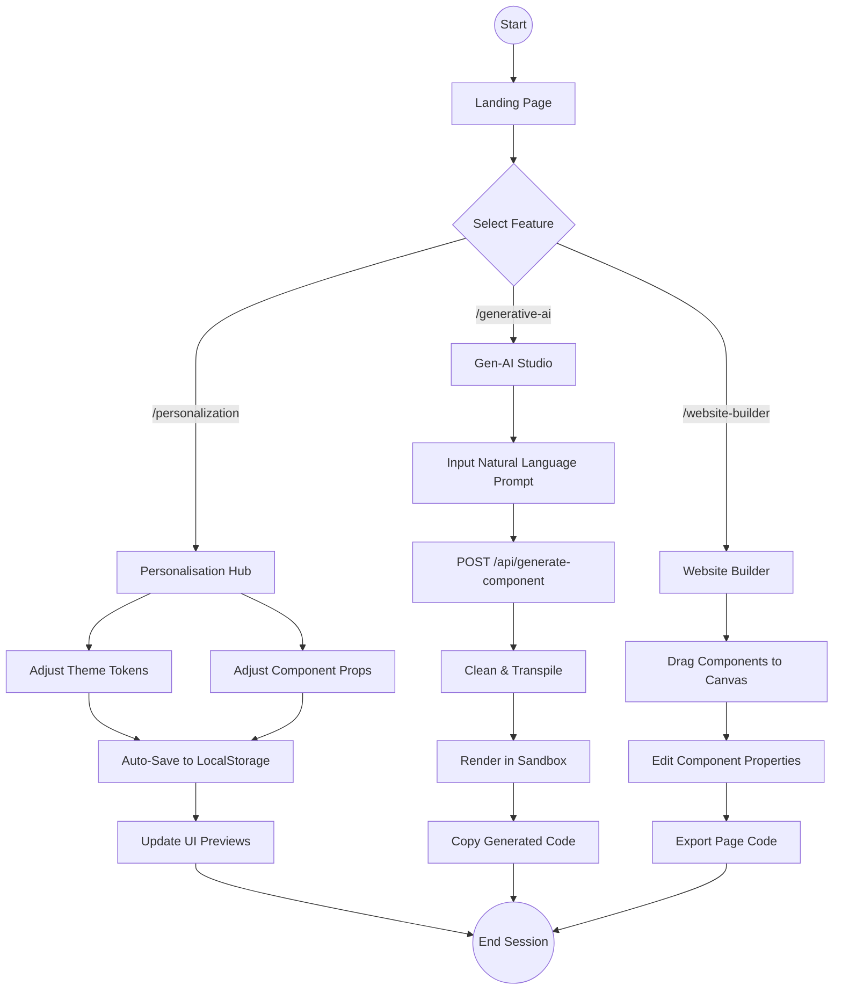

# Project Workflow and Features Documentation

This document provides a comprehensive overview of the project's features, specifically focusing on **Customisation**, **Personalisation**, **Gen-AI**, and **Website Builder**. It details the workflow and data flow for each module.

## 1. Feature Overview

The project is a **UI Component Library and Toolkit** that empowers users to:
1.  **Customize** global themes and individual component styles.
2.  **Personalize** their experience with persistent settings.
3.  **Generate** UI components using AI (Gen-AI).
4.  **Build** complex pages using a drag-and-drop Website Builder.

---

## 2. Personalisation & Customisation

**Location:** `/personalization`
**Primary Files:**
- `src/app/personalization/page.tsx` (Main Entry)
- `src/personalisationcomp/tabs.tsx` (Tab Controller)
- `src/personalisationcomp/customisation.tsx` (Component Settings Definitions)
- `src/personalisationcomp/data.tsx` (Data Structure Display)

### Workflow
1.  **User Identity**: On load, the app checks `localStorage` for a `userId`. If missing, it generates a new one. This ID is used to scope settings.
2.  **Tabs System**: Users navigate between two main modes:
    -   **Theme Customization**: Global settings (Colors, Typography, Presets).
    -   **Component Personalization**: Granular settings for specific components (Buttons, Inputs, etc.).
3.  **Interaction**:
    -   Users adjust sliders, color pickers, and toggles.
    -   Changes are reflected instantly in the UI.
    -   The `Data` view updates in real-time to show the JSON structure of the customizations.

### Data Flow


```mermaid
graph LR
    User[User Action] --> |Updates| State[React State]
    State --> |Propagates to| Components[Preview Components]
    State --> |Formatted as| JSON[JSON Data View]
    State -.-> |Persists to| LocalStorage[LocalStorage / User Profile]
```

### Customisation Options
Defined in `customisation.tsx`, users can tweak:
-   **Buttons**: Size, weight, radius, padding, shadows.
-   **Inputs**: Font size, borders, placeholders.
-   **Cards**: Padding, radius, depth.
-   **Layouts**: Spacing, margins.

---

## 3. Generative AI (Gen-AI)

**Location:** `/generative-ai`
**Primary Files:**
-   **Frontend:** `src/app/generative-ai/page.tsx`, `ComponentPreview`, `CodeDisplay`
-   **Backend:** `/backend/index.js` (API Endpoint)

### Workflow
1.  **Input**: User enters a natural language prompt (e.g., "A modern pricing card with blue gradients").
2.  **Generation**: The app sends this prompt to the backend.
3.  **Processing**: The backend calls the Groq API (Llama 3.3 model) to generate React code.
4.  **Cleaning**: The raw model output is cleaned (removing markdown, `use client`, etc.).
5.  **Preview**: The code is sent back to the frontend, transpiled in the browser using Babel, and rendered inside a sandboxed iframe.

### Data Flow


---

## 4. Website Builder

**Location:** `/website-builder`
**Primary Files:**
-   `src/app/website-builder/page.tsx`

### Workflow
The website builder is a client-side, drag-and-drop editor.
1.  **Sidebar**: Displays a list of available components categorized into **Layout** (Navbar, Grid, Container), **Basic** (Button, Text, Image), and **Components** (Card, Quote).
2.  **Canvas**: The main work area where components are dropped.
3.  **Drag & Drop**: Users drag items from the sidebar to the canvas or nest them inside existing containers (e.g., dropping a Button into a Card).
4.  **Edit Properties**: Clicking a component on the canvas opens the **Properties Panel**, allowing edits to props (text, colors, sizes).
5.  **Export**: Users can click "Copy Code" to generate the full React JSX and CSS for their layout.

### Data Flow
The core data structure is a recursive tree of `ComponentData` nodes:

```typescript
interface ComponentData {
  id: string;
  type: string;       // e.g., 'button', 'card'
  props: ComponentProps;
  children: ComponentData[]; // Recursive nesting
  isContainer?: boolean;
}
```

**Flow:**
1.  **Action**: User drops an item.
2.  **Logic**: `traverseAndAdd()` updates the component tree state.
3.  **Render**: `renderComponentTree()` recursively converts the state tree into React components for the canvas.
4.  **Code Gen**: `generateJSXRecursive()` walks the tree to build the final export string.



## Summary of Tabs

| Tab | Feature | Key Technology | Primary Data Persistence |
| :--- | :--- | :--- | :--- |
| **Personalisation** | Component & Theme Configuration | React, LocalStorage | LocalStorage / Context |
| **Gen-AI** | Text-to-UI Generation | Next.js, Express, Groq API, Babel | Session State (History) |
| **Website Builder** | Visual Page Construction | React DnD (Native), Recursive Rendering | Component Tree State (In-Memory) |

---

## 5. System Diagrams

### DFD Level 0 (Context Diagram)

This diagram illustrates the high-level interaction between the System (NewGen UI Token System) and external entities (User, AI Provider).

```mermaid
flowchart LR
    User[User / Developer]
    System(NewGen UI Toolkit)
    GroqAPI[Groq API (LLM)]

    User -- "1. Provides Prompts" --> System
    User -- "2. Adjusts Settings" --> System
    User -- "3. Builds Components" --> System

    System -- "4. Displays UI Preview" --> User
    System -- "5. Exports React Code" --> User

    System -- "6. Sends Prompts" --> GroqAPI
    GroqAPI -- "7. Returns Generated Code" --> System
```

### System Flow Chart

This diagram depicts the logical flow of a user navigating through the application's major modules.



